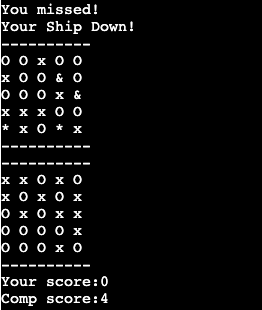

# Battleship One

Battleship one is a python terminal game, which run the code institute mock terminal on heroku.
the game is one player against the computer. Each has got 5 ships to hit using coordinates.

[Here is the live version on my project.](https://battleships-one.herokuapp.com/)

## How to play:
Battleship one is based on the classic Battleship game see on [Wikipedia](https://en.wikipedia.org/wiki/Battleship_(game)).
In this version when the game start you have two 5x5 boards
one on top with your ships marked with a '&' and are ramdomly generated
and the computers board at the bottom with the hidden ships.
the players is prompted to give coordinates, row first an column second
both having to be between 1 and 5.
the hits are marked with and 'x' and the players sunk ships are marked with an '*'.

## Features

### Existing features
* logo & rules
    * a pixelised logo with the rules right under at the start of the game

* Random board generation
    * Players ships are randomly placed on the board
    * computers ships are ramdomly generated but hidden from the player

* Player is asked to enter a row number
* Player is asked to enter a column number
* you are prompted with a "you missed!" message when you miss the computers ships
* you are prompted with a "your ship down" message when the computer hits your ship 
   and your boat '&' turn into '*'
* the your score and comp score appears after each turn.
* the board is marked with a 'x' where it has been hit

* Input validation error if the player chooses a row or and column over 5.

* prompt a message if the player hits a space already hit

* hits
  * board marked with a 'x' where there is a hit.
  * board marked with a '*' where the player boat got hit.

* End of the game
  * the computer wins
  * the player wins
  * you are then asked if you want to play again with a y/n answer
    if y the game starts again or if n a peace message apear and the game quits.

### future features
  * mark computer ship hits with a '*'
  * introduce bigger ships

## Data model

## Testing

I have manually tested this project by doing the following:

* Passed the code throught a PEP8 linter and confirmed there are no problems
* Tested with ivalid inputs out of range and double hits.
* Tested in may local terminal and the Code Institute Heroku Terminal

### bugs 

#### solved bugs
* on the players choice i change comparison operator from 'and' to 'or' cause the two had to be had of range but now if either is out range it prompts the error message.

#### no bugs remaining

### Validator testing

* PEP8
    * No errors were returned

## Deployment

This project was deployed using Code Insitute's mock terminal for Heroku

* Steps for deployment:
    * Fork or clone this repository
    * create a new Heroku App
    * Set the buildback to python and NOdejs in that order 
    * Link the Heroku App to the repository
    * Click on Deploy

## Credits 

* Code Institute for the deployment terminal
* wikipedia for the battleship game details
* [Fsymbols](https://fsymbols.com/text-art/) for the pixels texts art
